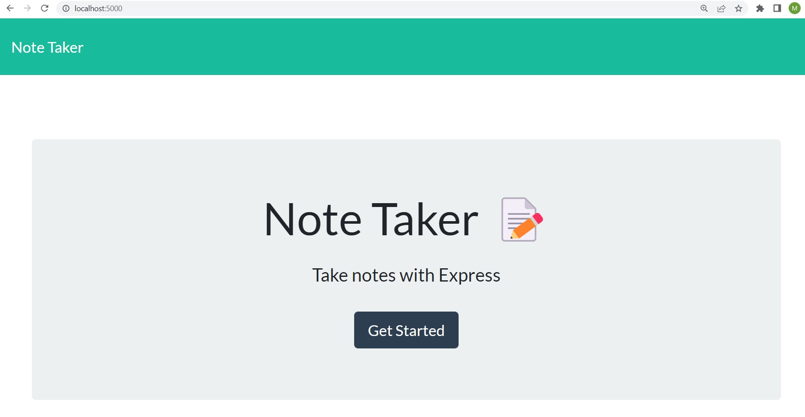
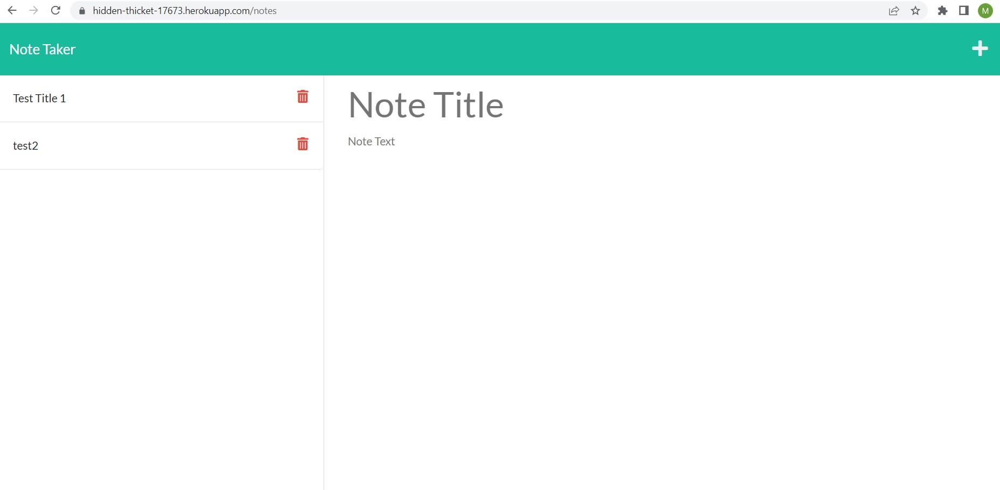
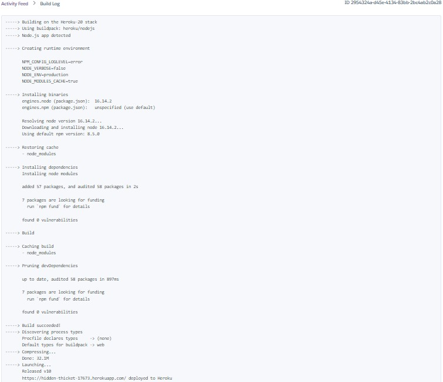

# Express.js Note Taker

## 11-Homework

This application allows the user to write and save notes in order to better organize ideas and keep track of tasks in production.

## Mock-up

## Installation

This application requires installation 

A sample HTML page can be found here: https://hidden-thicket-17673.herokuapp.com/

All elements of the project can be examined here: https://github.com/matthewestes33/expressnotetaker

## Credits

Referenced documentation and tutorials:

Express 5.x - API Reference: https://expressjs.com/en/5x/api.html

Deploying Node.js Apps on Heroku: https://devcenter.heroku.com/articles/deploying-nodejs 

uuid - npm: https://www.npmjs.com/package/uuid

Additional assistance:

Thank you to my instructional staff, weekly tutor, and AskBCS Learning Assistants!

## Features

When the Note Taker app is opened, the user is presented with a landing page with a link to a notes page.

On the notes page, the user is presented with a page with existing notes listed in the left-hand column, plus empty fields to enter a new note title and text in the right-hand column.

When the user enters a new note title and text, a Save icon appears on the navigation bar.

When the user clicks on the Save icon, the new note is saved and appears in the left-hand column with the other existing notes.

When the user clicks on a saved note, then that note appears in the right-hand column.

When the user clicks on the Write icon on the navigation bar, then an empty field to enter a new note title and text in the right-hand column.

